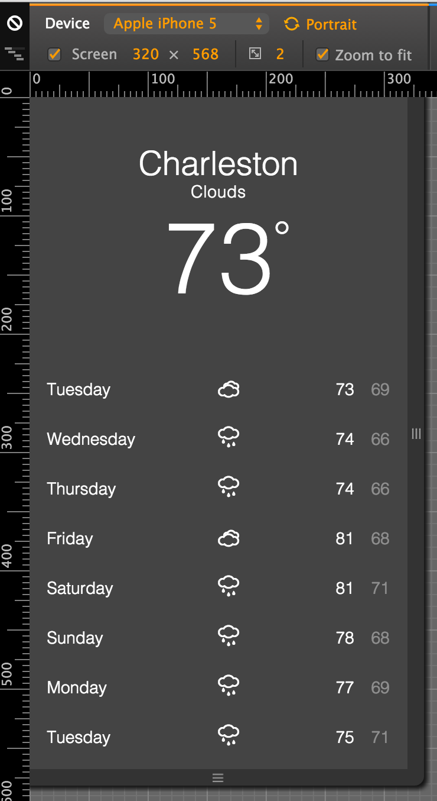

# What's the Weather?
This repository contains both `before` and `after` sections.

The `before` section is intended to act as a springboard for getting the weather application to work. Given it already has HTML, CSS & a mostly empty JavaScript file, you are already set to focus on your JavaScript skills without having to deal with pesky styling.

The `after` section is an _example_ solution that is intended as an easy-to-understand guide.

Your final product should look something like this:

